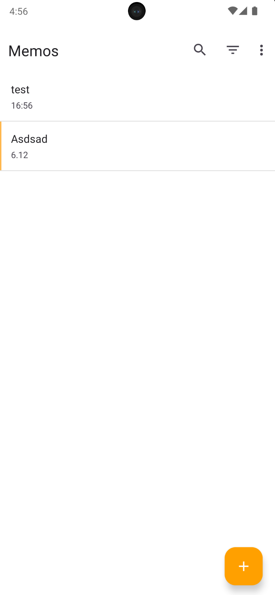
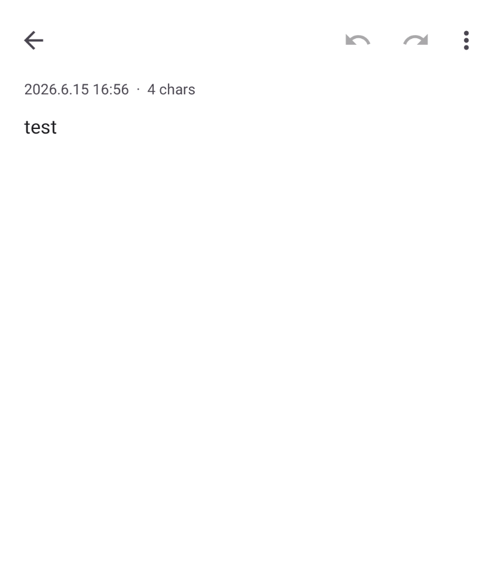
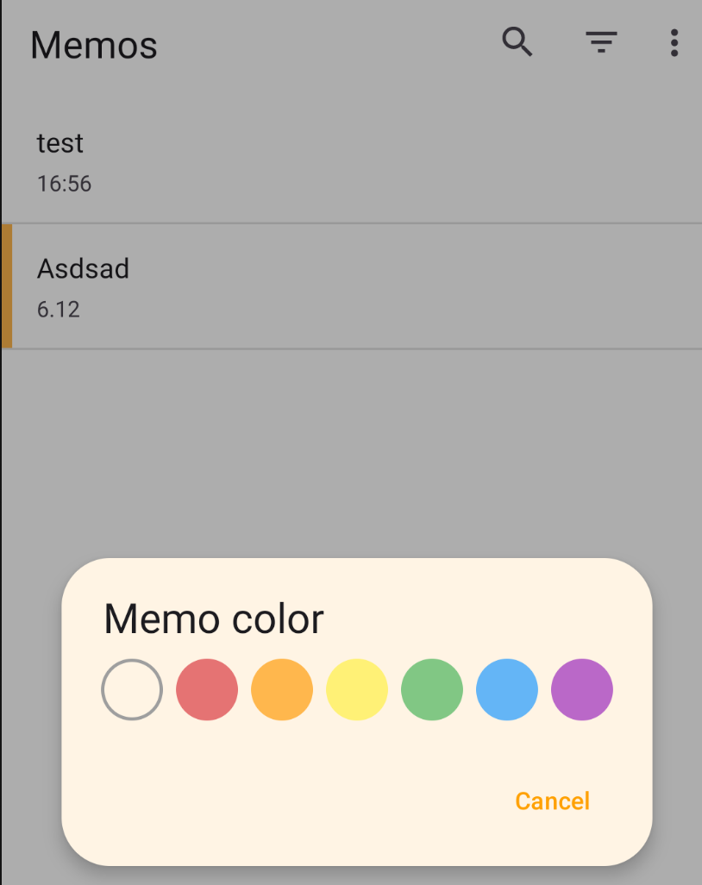
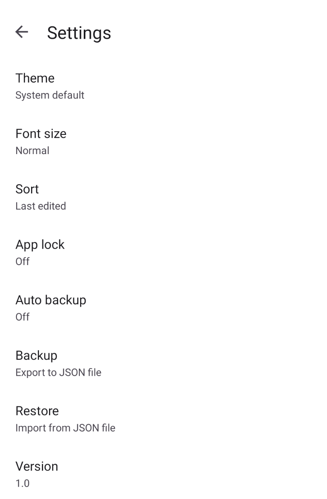

# 심플메모 (SimpleMemo)

군더더기 없이 빠르게 적고 관리하는 안드로이드 메모 앱. 외부 서버나 계정 없이 기기 내부에 메모를 저장하는 오프라인 우선(offline-first) 앱입니다.

## 스크린샷

| 메모 목록 | 메모 편집 | 색상 선택 | 설정 |
|:---:|:---:|:---:|:---:|
|  |  |  |  |

## 주요 기능

### 메모 작성
- **제목 자동 추출** — 본문 첫 줄이 제목, 나머지가 미리보기로 표시됩니다.
- **체크리스트** — `- [ ]` / `- [x]` 마커를 ☐ / ☑ 기호로 표시합니다.
- **#태그** — 본문에 `#태그` 형식으로 적으면 태그별로 모아볼 수 있습니다.
- **메모 색상** — 7가지 색상(없음/빨강/주황/노랑/초록/파랑/보라) 라벨.
- **실행 취소 / 다시 실행** — 편집 중 되돌리기 지원.

### 목록 관리
- **검색** — 본문 전체 텍스트 검색.
- **필터** — 색상별, 태그별 필터링.
- **정렬** — 수정일순 / 최근 작성순 / 오래된 작성순 / 가나다순 / 직접 정렬순(드래그).
- **고정(Pin)** — 중요한 메모를 목록 맨 위에 고정.
- **다중 선택** — 여러 메모를 한 번에 선택해 처리.
- **공유** — 메모 내용을 다른 앱으로 공유.

### 알림
- **리마인더** — 메모별로 알림 시각을 지정해 정해진 시간에 알림을 받습니다.
- 재부팅 후에도 예약된 알림이 유지됩니다(BootReceiver).
- 정확한 알람 권한(`SCHEDULE_EXACT_ALARM`)을 사용해 정시 알림을 제공합니다.

### 휴지통
- 삭제한 메모는 휴지통으로 이동하며 **복원**할 수 있습니다.
- 휴지통에서 **완전 삭제** 또는 **휴지통 비우기** 가능.

### 백업 / 복원
- **수동 백업** — JSON 파일로 내보내기 / 가져오기.
- **자동 백업** — 매일 앱 폴더에 자동 백업, 최근 7개 보관(WorkManager).

### 보안 / 위젯 / 테마
- **앱 잠금** — 생체 인증(지문 등)으로 앱을 잠급니다.
- **홈 화면 위젯** — 메모 목록을 홈 화면에서 바로 확인.
- **테마** — 시스템 설정 / 라이트 / 다크.
- **글자 크기** — 작게 / 보통 / 크게 / 아주 크게.
- **다국어** — 한국어(기본), 영어.

## 기술 스택

- **언어**: Kotlin
- **플랫폼**: Android (minSdk 19, targetSdk 36)
- **빌드**: Gradle (Kotlin DSL), Version Catalog
- **저장소**: SQLite (`SQLiteOpenHelper` 기반 `MemoDbHelper`)
- **주요 라이브러리**: AndroidX AppCompat / Core-KTX / RecyclerView, Material Components, WorkManager, AndroidX Biometric

## 프로젝트 구조

```
app/src/main/java/com/lunastratos/simplememo/
├─ MainActivity.kt          # 메모 목록 (검색/필터/정렬/선택)
├─ EditActivity.kt          # 메모 작성·편집
├─ TrashActivity.kt         # 휴지통
├─ SettingsActivity.kt      # 설정
├─ LockActivity.kt          # 앱 잠금 화면
├─ MemoAdapter.kt           # 목록 RecyclerView 어댑터
├─ MemoTouchCallback.kt     # 드래그 정렬·스와이프
├─ MemoWidget.kt            # 홈 화면 위젯
├─ MemoWidgetService.kt     # 위젯 데이터 제공
├─ ReminderReceiver.kt      # 알림 수신
├─ BootReceiver.kt          # 재부팅 후 알림 재예약
├─ AutoBackupWorker.kt      # 일일 자동 백업
├─ data/                    # Memo 모델, DB, 백업, Prefs
└─ util/                    # 포맷, 색상, 알림 스케줄러
```

## 빌드 및 실행

```bash
./gradlew assembleDebug      # 디버그 APK 빌드
./gradlew installDebug       # 연결된 기기/에뮬레이터에 설치
./gradlew test               # 단위 테스트
```

> Android Studio에서 프로젝트를 열어 실행하는 것을 권장합니다.